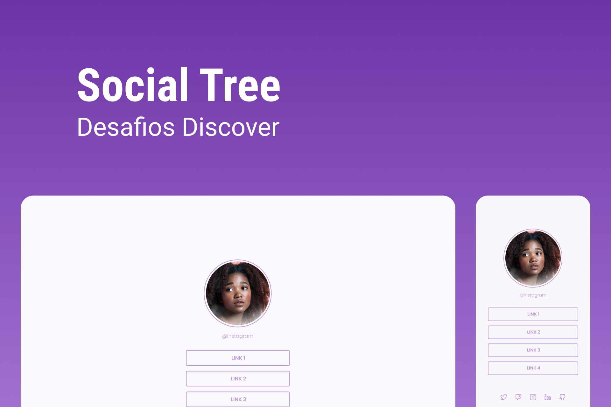

<h1 align="center">
  Social Tree
</h1>

  
  
  

<h1 align="center">
  
</h1>

 

## 💻 Projeto

Projeto de uma página com uma lista de links que pode ser usada em perfis de redes sociais.

## 🧪 Tecnologias

Esse projeto foi desenvolvido com as seguintes tecnologias

- HTML
- CSS

---

Feito com 💜 by Pedro Duarte 👋🏻
